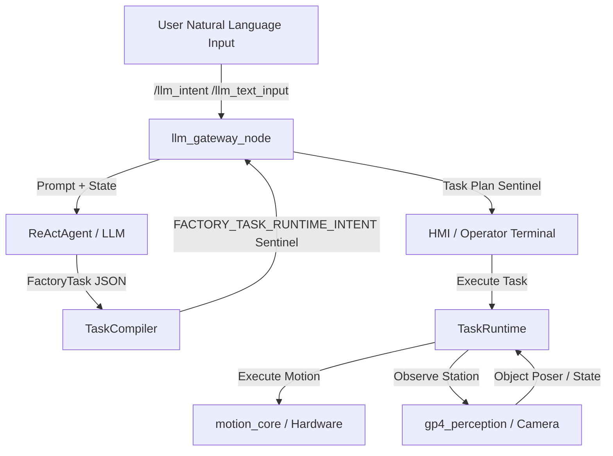

# Design Specification: Transition to FactoryTask Autonomy Architecture

**Date:** 2026-06-10
**Author:** Antigravity (Google DeepMind)
**Status:** Under Review

---

## 1. Goal & Context
The goal of this redesign is to fully migrate the `llm_gateway` package from the legacy **Open-Loop Semantic IR Interpreter** architecture to a **Closed-Loop FactoryTask Autonomy** architecture. 

In the initial implementation, natural language instructions (e.g., "move to pose A") were parsed directly into static `Semantic IR` commands (like `move_named_pose` with a target string), which bypass the LLM and are routed via `IntentRouter`. This routing requires the target region/object coordinates to be statically defined in the SRDF or station semantic map. If they are not present, the execution fails early.

By transitioning exclusively to the **FactoryTask Autonomy** architecture, the system will output a Behavior Tree-like task structure (`FactoryTask`). The execution engine (HMI and `TaskRuntime`) will dynamically manage runtime control flow (retry, fallback, observe, repeat), resolve spatial coordinates dynamically via camera perception tools at execution time, and prevent early failures due to missing static coordinates.

---

## 2. System Architecture & Component Interactions

### Data Flow Changes:
1. **Input Interception Removal:** All user queries (simple or complex) bypass regex parsing and are directed to the LLM agent.
2. **Standardized Task Payload:** The output of `llm_gateway_node` to the HMI will **always** be a `FACTORY_TASK_RUNTIME_INTENT` payload, carrying the full execution plan (`runtime_plan`) and policies.
3. **Execution Decoupling:** `IntentRouter` is bypassed for all generated plans, preventing static checking from rejecting dynamically groundable poses.

---

## 3. Component Details & Modifications

### A. llm_gateway_node.py
- **Deprecate Direct Parse Handlers:** Remove `_direct_review_semantic_ir`, `_direct_named_pose_review_semantic_ir`, `_direct_cartesian_review_semantic_ir`, and `_direct_joint_review_semantic_ir`.
- **Force Sentinel Compilation:** Modify `_compile_factory_task_review_result` to always return the runtime execution sentinel (`FACTORY_TASK_RUNTIME_INTENT`). The compiler must no longer attempt to flatten `sequence` or `skill` nodes into raw static Semantic IR.
- **Simplify `_on_review_intent`:** Bypass `IntentRouter` for compiled FactoryTasks. If an error is returned from the LLM, format it directly to the operator.

### B. react_planner.py (ReActAgent System Prompts)
- **Deprecate `MISSING_SLOT` for Unknown Poses:** Update `_REACT_SYSTEM_PROMPT_PREFIX` to instruct the LLM that it should never immediately return `MISSING_SLOT` when encountering physical objects or regions not statically listed in the environment state.
- **Instruct FactoryTask Generation:** When referencing dynamic objects (e.g. `red_box`) or unknown regions, the LLM must generate a `move_to_object` or `pick_object` skill node. The prompt will inform the LLM that the downstream `TaskRuntime` will automatically invoke perception tools (`query_perception`) to ground these poses before motion execution.

### C. factory_task.py (TaskCompiler)
- **Compiler Safety Checks:** Ensure the `TaskCompiler` validates structural constraints (e.g., that children nodes exist for control elements) but does not validate target pose availability during compiler-phase static checks. Real-time pose checking is deferred to `TaskRuntime`.

---

## 4. Testing & Verification Plan

### Unit and Integration Tests
- **Validate Direct Regex Removal:** Modify `test_direct_review_regex.py` or remove it if all direct paths are deprecated, ensuring the system strictly delegates command understanding to the LLM/ReAct gateway.
- **FactoryTask Execution Sentinel Test:** Write a test in `test_react_gateway_pipeline.py` checking that simple commands like "move to pose A" and complex commands like "move to A then go home" generate a `FACTORY_TASK_RUNTIME_INTENT` carrying the correct node tree structures.
- **Validation of System Prompts:** Verify that the ReAct prompt does not trigger early error rejections for missing slots when a task structure is possible.
